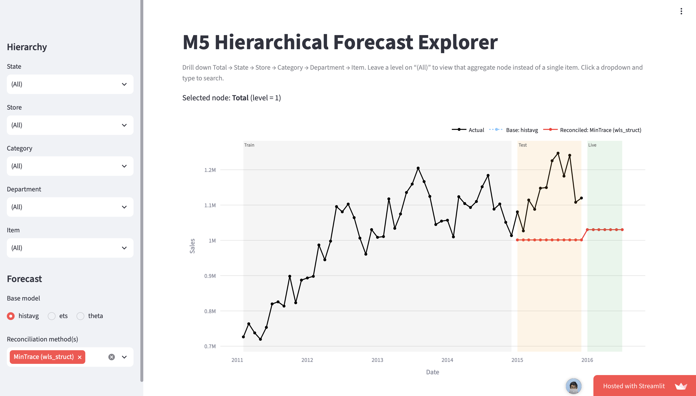

# Hierarchical Time Series Forecasting on the M5 Walmart Dataset

**A Business-Focused Evaluation of Foundational Reconciliation Methods in Retail Demand**

[](https://m5-hierarchical-forecast-explorer.streamlit.app/)

[](https://python.org)
[](https://nixtlaverse.nixtla.io/)
[](https://pandas.pydata.org)
[](https://streamlit.io)
[](https://plotly.com/python/)
[](https://jupyter.org)
[](https://www.latex-project.org)

<table>
<tr>
<td width="60%">

**Author:** Hemanth Jadiswami Prabhakaran (7026000)

**First Examiner:** Prof. Dr. Joachim Schwarz  
**Second Examiner:** Prof. Dr.-Ing. Armando Walter Colombo  
**University:** Hochschule Emden/Leer (University of Applied Sciences Emden/Leer)  
**Program:** Master's in Business Intelligence and Data Analytics

</td>
<td width="40%">

</td>
</tr>
</table>

---

## 📋 Project Overview

Retail demand has to be forecast consistently at many levels at once: company total, state, store, category, department and single item. Forecasts made independently at each level don't add up, and **reconciliation** methods fix that. These methods are usually compared with one averaged error measure that treats every series as equally important, although a small share of products carries most of the sales volume.

This master's thesis compares **3 base forecasting models × 3 reconciliation methods** on the **M5 Walmart dataset**. It evaluates every combination both **by hierarchy level** and **by business volume segment** (top 5 %, 10 %, 20 %, 50 %, 80 % and 100 % of sales volume).

### Key Features

- **Six-level hierarchy**: Total → State → Store → Category → Department → Item, 30,354 monthly series
- **Base models**: HistoricAverage, AutoETS, Theta (`statsforecast`)
- **Reconciliation**: Bottom-Up, Top-Down (proportion averages), MinTrace (`wls_struct`, non-negative) (`hierarchicalforecast`)
- **Business-focused evaluation**: sMAPE by hierarchy level *and* by cumulative volume segment, ranked on training data only
- **Reproducible pipeline**: two notebooks, one shared `config.py`, pinned requirements, built-in validation checks
- **Interactive dashboard**: Streamlit app with cascading hierarchy drill-down, deployed on Streamlit Community Cloud

---

## 🌐 Live Dashboard

**👉 [m5-hierarchical-forecast-explorer.streamlit.app](https://m5-hierarchical-forecast-explorer.streamlit.app/)**

Pick any node in the hierarchy, choose a base model and one or more reconciliation methods, and compare the forecasts with actual sales. The train, test and live periods are shaded on the chart. If the app has been idle, click *"Yes, get this app back up!"* and wait about a minute.

---

## 📚 Documentation

### Quick Access Documents

| Document | PDF | LaTeX Source |
|----------|-----|--------------|
| **Thesis Report** | [📄 ThesisReport.pdf](./report/ThesisReport.pdf) | [ThesisReport.tex](./report/ThesisReport.tex) |
| **User Manual** | [📄 ThesisManual.pdf](./Manual/ThesisManual.pdf) | [ThesisManual.tex](./Manual/ThesisManual.tex) |
| **Project Poster** | [📄 ThesisPoster.pdf](./Poster/ThesisPoster.pdf) | [ThesisPoster.tex](./Poster/ThesisPoster.tex) |
| **Final Presentation** | [📄 ThesisPresentations.pdf](./Presentations/ThesisPresentations/ThesisPresentations.pdf) | [ThesisPresentations.tex](./Presentations/ThesisPresentations/ThesisPresentations.tex) |
| **Literature Review** | [📄 ThesisLiterature.pdf](./Presentations/Literature/ThesisLiterature.pdf) | [ThesisLiterature.tex](./Presentations/Literature/ThesisLiterature.tex) |

> 🔍 **Plagiarism check** (Scribbr, Sept 2026): 5% overall similarity, no single source above 1%.

---

## 🔧 Data & Software

| Component | Specification |
|-----------|---------------|
| **Dataset** | [M5 Forecasting – Accuracy](https://www.kaggle.com/competitions/m5-forecasting-accuracy) (Walmart, 3 states, 10 stores, 3,049 items, daily 2011-01-29 → 2016-04-24) |
| **Frequency** | Monthly (daily sales aggregated) |
| **Time windows** | Train Feb 2011 – Dec 2014 · Test Jan – Dec 2015 · Live Jan – Jul 2016 (forecast only) |
| **Hierarchy** | 1 Total · 3 States · 10 Stores · 30 Categories · 70 Departments · 30,240 Item-Store series |
| **Forecasting** | `statsforecast` 2.1.1, `hierarchicalforecast` 1.5.1, `utilsforecast` 0.2.16 |
| **Data stack** | `pandas` 2.3.3, `numpy` 2.2.6, `pyarrow` 24.0.0 |
| **Dashboard** | `streamlit` 1.61.1, `plotly` 6.9.0, `st-theme` 1.2.3 |
| **Metric** | sMAPE (0–100 % convention, 0/0 treated as 0) |

---

## 📁 Repository Structure

```
MBIDA_Master_Thesis/
├── Code/                                # Implementation (see Code/README.md)
│   ├── config.py                        # Single source of truth for pipeline + app
│   ├── notebooks/
│   │   ├── 01_eda.ipynb                 # EDA: justifies every cleaning decision
│   │   ├── 02_pipeline.ipynb            # Hierarchy, models, reconciliation, evaluation, export
│   │   └── requirements-pipeline-raw.txt# Pinned pipeline environment
│   ├── app/
│   │   ├── streamlit_app.py             # Dashboard (reads parquet files only)
│   │   └── requirements.txt             # Minimal deployment dependencies
│   ├── artifacts/
│   │   ├── dashboard_data/              # 4 committed parquet files the app reads
│   │   └── raw_cache/                   # Gitignored parquet cache of the raw CSVs
│   └── data/                            # README + gitignored m5/ folder for Kaggle CSVs
├── Documents/                           # Bibliography (MyLiterature.bib) and literature PDFs
├── report/                              # Thesis report (LaTeX)
├── Manual/                              # Dashboard user manual (LaTeX)
├── Poster/                              # Thesis poster (LaTeX)
├── Presentations/
│   ├── Literature/                      # Literature review slides
│   └── ThesisPresentations/             # Final presentation slides
├── .streamlit/config.toml               # Streamlit theme (must stay at repo root)
└── .devcontainer/                       # GitHub Codespaces / dev container setup
```

---

## 🚀 Quick Start

### 1. Run the Dashboard Locally

Only the committed parquet files are needed, not the raw data.

```bash
git clone https://github.com/Hemanth-Jp/MBIDA_Master_Thesis.git
cd MBIDA_Master_Thesis

python3 -m venv .venv
source .venv/bin/activate            # Windows: .venv\Scripts\Activate.ps1
pip install -r Code/app/requirements.txt

streamlit run Code/app/streamlit_app.py   # run from the repo root
```

Open **http://localhost:8501**.

> ⚠️ The theme package is `st-theme` (imported as `streamlit_theme`), **not** `streamlit-theme`. Always install from the requirements file.

### 2. Reproduce the Full Pipeline

1. Download `sales_train_validation.csv` and `calendar.csv` from [Kaggle](https://www.kaggle.com/competitions/m5-forecasting-accuracy/data) into `Code/data/m5/`.
2. Create the pipeline environment:
   ```bash
   python3 -m venv .venv-pipeline
   source .venv-pipeline/bin/activate
   pip install -r Code/notebooks/requirements-pipeline-raw.txt
   ```
3. Run `Code/notebooks/01_eda.ipynb`, then `Code/notebooks/02_pipeline.ipynb`, **top to bottom** (*Restart & Run All*). The last cell writes the four parquet files to `Code/artifacts/dashboard_data/`.
4. Commit and push `Code/artifacts/dashboard_data/` to update the online dashboard.

A full run takes roughly 15–30 minutes, and 16 GB RAM is recommended.

---

## 🔄 Pipeline

```
Kaggle CSVs (Code/data/m5/)
        │
        ▼
01_eda.ipynb ─────────────► justifies every decision below
        │
        ▼
02_pipeline.ipynb  (imports config.py)
  • aggregate daily → monthly
  • drop partial first month (Jan 2011, only 3 days)
  • fix item universe on training data only (3,049 → 3,024 items)
  • add explicit "Total" root and build 6-level hierarchy
  • fit HistoricAverage / AutoETS / Theta (season_length = 12)
  • clip negative base forecasts at 0
  • reconcile: Bottom-Up / MinTrace (wls_struct) / Top-Down
  • evaluate sMAPE by level and by volume segment
        │
        ▼
Code/artifacts/dashboard_data/*.parquet ──► Code/app/streamlit_app.py ──► live dashboard
```

---

## 📊 Key Results (Test Year 2015, sMAPE %)

**By hierarchy level, reconciled:**

| Level | ETS BU | ETS MinT | ETS TD | Theta BU | Theta MinT | Theta TD |
|-------|:------:|:--------:|:------:|:--------:|:----------:|:--------:|
| Total | **3.94** | 5.19 | 5.53 | **3.78** | 4.36 | 4.24 |
| State | **3.97** | 5.11 | 5.88 | **3.76** | 4.36 | 4.77 |
| Store | **4.77** | 5.58 | 7.60 | **4.86** | 5.25 | 6.97 |
| Category | **6.22** | 7.19 | 10.63 | **6.18** | 6.52 | 9.75 |
| Department | **7.91** | 8.00 | 12.38 | **7.60** | 7.98 | 11.49 |
| Item | **37.72** | 40.62 | 40.74 | **36.32** | 39.24 | 40.54 |

**By volume segment (bottom-level item-store series):**

| Top % of volume | Series | HistoricAverage | ETS BU | ETS TD | Theta BU | Theta TD |
|:---------------:|-------:|:---------------:|:------:|:------:|:--------:|:--------:|
| 5 % | 29 | **16.61** | 22.97 | 16.98 | 22.97 | 17.47 |
| 10 % | 94 | **22.51** | 29.88 | 22.91 | 30.41 | 23.42 |
| 20 % | 326 | **27.89** | 33.43 | 28.14 | 32.79 | 28.48 |
| 50 % | 2,151 | **28.88** | 31.93 | 28.99 | 31.04 | 29.16 |
| 80 % | 8,155 | **29.68** | 31.84 | 29.69 | 31.10 | 29.73 |
| 100 % | 30,240 | 40.91 | 37.72 | 40.74 | **36.32** | 40.54 |

*At the bottom level, Bottom-Up (BU) equals the unreconciled base forecast, so the BU columns are also the base-model results. Buckets are cumulative: each one contains the smaller ones above it.*

**Takeaways**

- **Bottom-Up** is the most accurate reconciler at every aggregate level. Structurally scaled MinTrace doesn't realise its theoretical advantage here.
- On **high-volume series**, the flat **HistoricAverage** and **Top-Down** beat the seasonal models.
- Once the **long tail** is included, the ranking **reverses**: Bottom-Up Theta is best overall.
- No single combination wins everywhere, so the method should match the business question and volume segment.

---

## ✅ Validation

The pipeline checks its own output before any results are reported:

| Check | Result |
|-------|--------|
| Coherence (HistoricAverage vs. its Bottom-Up reconciliation) | max diff 0.146 (float precision) |
| Top-Down root invariance (Total unchanged) | max diff 0.000000 |
| Fallback rate to HistoricAverage (ETS / Theta) | 699 of 30,354 series (2.30 %) |
| Negative forecasts after clipping | 0 in every column |
| Ground-truth merge | 0 missing rows, 1:1 validated |

---

## 🛠️ Troubleshooting

**"This app has gone to sleep"**
- Normal on the free tier. Click the wake-up button and wait about a minute.

**`ModuleNotFoundError: streamlit_theme`**
- The wrong package is installed: `pip uninstall streamlit-theme && pip install st-theme==1.2.3`

**"Couldn't find one of the required parquet files"**
- Restore them with `git checkout -- Code/artifacts/dashboard_data/`, or regenerate them with `02_pipeline.ipynb`.

**Theme settings not applied locally**
- Start Streamlit from the **repo root** so `.streamlit/config.toml` is picked up.

The [User Manual](./Manual/ThesisManual.pdf), Chapter 8, covers every error message.

---

## 🏗️ System Architecture

```
                 Code/config.py
          (columns · hierarchy · windows · reconciler names)
            ↙               ↓                ↘
   01_eda.ipynb      02_pipeline.ipynb     app/streamlit_app.py
                            │                      ↑
                            ▼                      │
              artifacts/dashboard_data/*.parquet ──┘
                            │
                     git push → Streamlit Community Cloud
```

---

### Literature & References

- **Bibliography Database**: [MyLiterature.bib](./Documents/MyLiterature.bib)
- **Literature PDFs**: [Documents/MyLiteratureFiles/](./Documents/MyLiteratureFiles/)

### Code Documentation

- **Code Overview & Data Flow**: [Code/README.md](./Code/README.md)
- **Data Download Instructions**: [Code/data/README.md](./Code/data/README.md)

---

## 🎓 Academic Context

**Type**: Master's Thesis  
**Term**: Summer Semester 2026  
**University**: Hochschule Emden/Leer, Faculty of Technology, Department of Mechanical Engineering  
**Program**: Business Intelligence and Data Analytics (MBIDA)

**Topics covered**: Hierarchical Time Series Forecasting, Forecast Reconciliation, Retail Demand Planning, Business-Oriented Evaluation, Reproducible Data Science, Dashboard Deployment

---

## 📄 License

- **M5 data**: subject to the [Kaggle competition rules](https://www.kaggle.com/competitions/m5-forecasting-accuracy/rules). Not redistributed in this repository.

Open-source components:
- **statsforecast / hierarchicalforecast / utilsforecast**: Apache 2.0 License
- **Streamlit**: Apache 2.0 License
- **Plotly**: MIT License
- **pandas / NumPy**: BSD 3-Clause License
- **PyArrow**: Apache 2.0 License

---

**Repository**: [https://github.com/Hemanth-Jp/MBIDA_Master_Thesis](https://github.com/Hemanth-Jp/MBIDA_Master_Thesis)

*Last Updated: September 2026*
